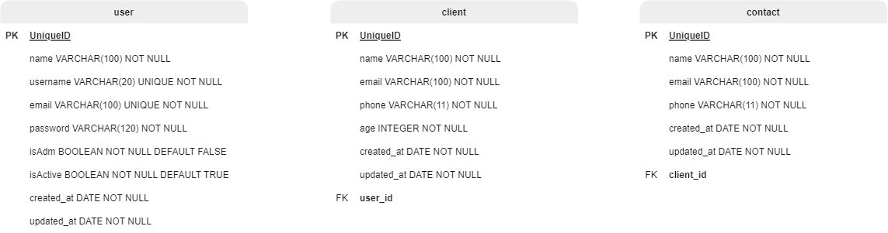

# Connection Point

A Connection Point é uma API voltada para o usuário se cadastrar, podendo registrar inúremos clientes, ao mesmo tempo que para cada cliente é possivel relacionar vários contatos.

<br/>

> ### <h2>SUMÁRIO:</h2>

* <a href="#techs" target="_self">Tecnologias</a>
* <a href="#tables" target="_self">Diagramas de Relacionamento</a>
* <a href="#config" target="_self">Como executar a aplicação</a>
* <a href="#requests" target="_self">Requisições</a>

<br/>

> ### <h2 id="techs">TENOLOGIAS:</h2>

* Express Js;
* TypeScript;
* TypeORM;
* JsonWebToken;
* Bcrypt.Js
* Dotenv;
* Ts-node-dev
* Pg;
* Reflect-Metadata;
* Class-Tranformer;
* Express-async-errors.

<br/>

> ### <h2 id="tables">DIAGRAMAS DE RELACIONAMENTO:</h2>

<br/>



<br/>

> ### <h2 id="config">COMO EXECUTAR A APLICAÇÃO:</h2>

* Faça clone desse repositório na máquina;
* Acesse a pasta do projeto;
* Instale as dependências:
  <br/>

  ```
  yarn install
  ```

* Renomeie o arquivo `.env.example` para `.env`;
* Insira as informações nas variávies de ambiente do `.env`;
* Crie um banco de dados postgres com o nome usado na variável de ambiente;
* Execute as migrations:
  <br/>

  ```
  yarn typeorm migration:run -d src/data-source
  ```

* Execute a aplicação:
  <br/>

  ```
  yarn dev
  ```

  * Você receberá as seguintes mensagem no terminal, indicando que a aplicação está sendo executada e que conectou-se ao banco de dados:
    * `Server running in port 3000`
    * `Database connected`
  
  * Utilize a URL http://localhost:3000 para fazer as requisições.
  
* Por fim, execute as requisições conforme instruções abaixo.
  
<br/>

> ### <h2 id="requests">REQUISIÇÕES:</h2>

<br>

> ## Create User - POST `/users`
>> Formato da requisição:
>
> * O `email` deve ser único;
> * Todos os campos são `obrigatórios`;
>
>```json
> {
>   "name": "Lucas Silva",
>   "username": "lucas_silva", 
>   "email": "lucas.silva@mail.com",
>   "password": "1234",
>   "isAdm": true
> }
>```
>
>> Formato da resposta:
>
> * Status: `201 CREATED`;
> * A `password` do usuário será armazenada como `hash` e `não será retornada` na resposta;
>
>```json
> {
>   "id": "c95d139f-5c57-46ec-9ca7-545944a2b10b",
>   "name": "Lucas Silva",
>   "username": "lucas_silva", 
>   "email": "lucas.silva@mail.com",
>   "isAdm": true,
>   "isActive": true,
>   "createdAt": "2022-10-21T23:19:09.501Z",
>   "updatedAt": "2022-10-21T23:19:09.501Z"
> }
>```
>
> ### E-mail já cadastrado
>> Formato da resposta:
>
> * Status: `409 CONFLICT`;
>
>```json
> {
>   "message": "E-mail already exists"
> }
>```
>---

<br/>

> ## Profile User - GET `/users/profile`
>> Formato da requisição:
>
> * Necessário autenticação por `token`
>
>> Formato da resposta:
>
> * Status: `200 OK`;
> * A `password` do usuário `não será retornada` na resposta;
>
>```json
> {
>   "id": "d54d166e-5c57-46ec-9ca7-545944a2b15b",
>   "name": "Lívia Oliveira",
>   "username": "livia", 
>   "email": "livia.oliveira@mail.com",
>   "isAdm": true,
>   "isActive": true,
>   "createdAt": "2022-10-21T23:19:09.501Z",
>   "updatedAt": "2022-10-21T23:19:09.501Z"
> }
>```
> ### Sem token / token inválido
>> Formato da resposta:
>
> * Status: `401 UNAUTHORIZED`;
>
>```json
> {
>   "message": "Missing authorization headers"
> }
>```
>---

<br>


* retrive user
* list users
* update user
* delete user


* login


* create client
* list clients
* retrieve client
* update client
* delete client


* create contact
* list contacts
* retrieve contact
* update contact
* delete contact
